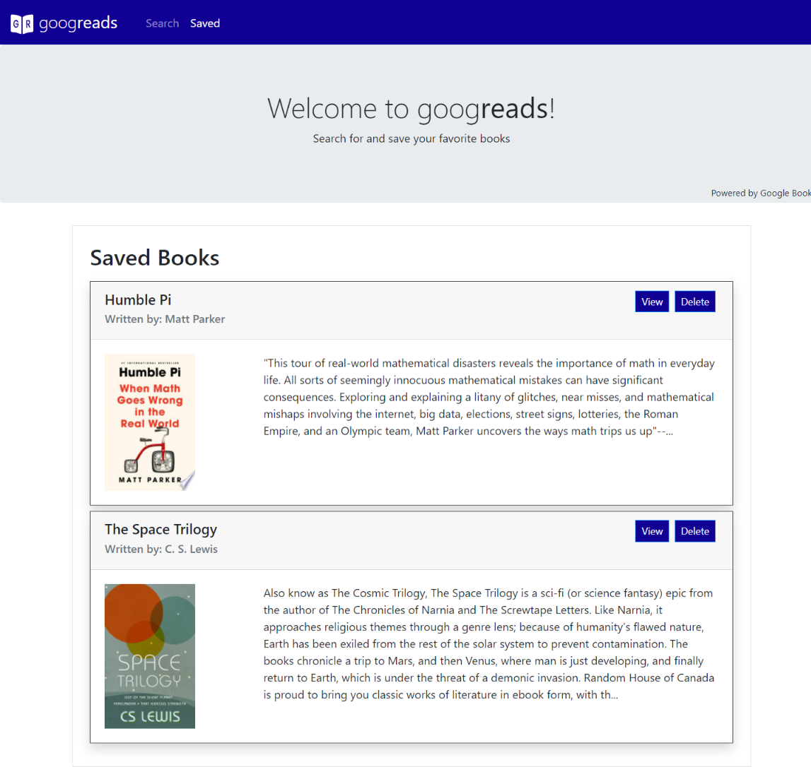
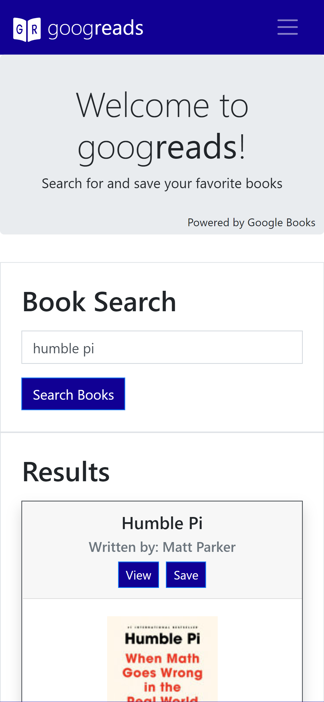
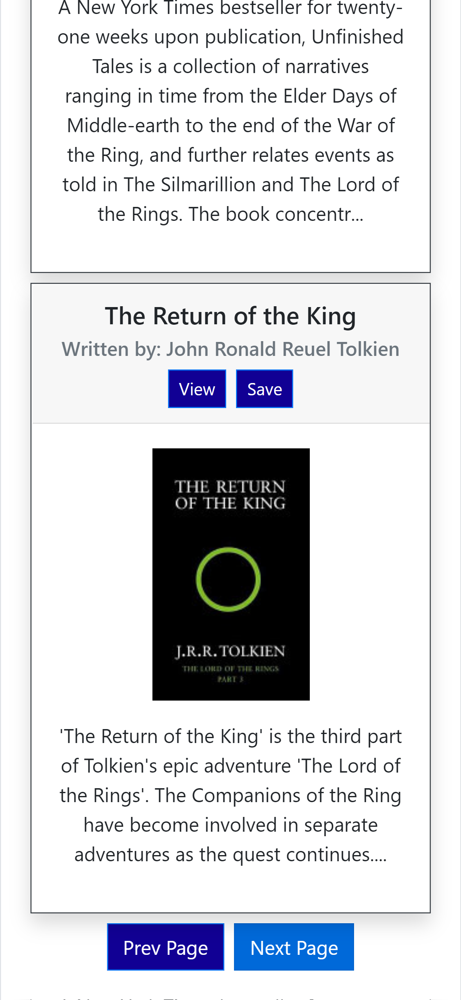
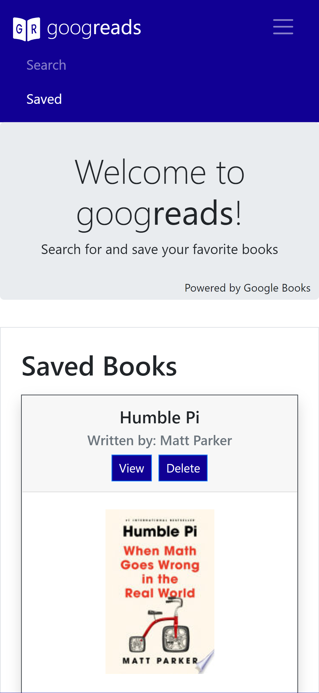

<div align="center">

#  *goog*reads

<div>
  
  


</div>

### React-based app allowing users to search for and save books to review or purchase later



</div>

## Table of Contents  
* [Features](#Features)  
* [Installation](#Installation)  
* [Scripts](#Scripts)  
* [Usage](#Usage)  
* [Technologies](#Technologies-Used)
* [Contributing](#Contributing)  
* [Reflection](#Reflection)  
* [Future Scope](#Future-Scope)  
* [Questions](#Questions)

## Features
- Search for books using Google Books API.
- Paginated search results for easier search experience & faster page load. 
- Save books for later reference to review or purchase on Google Books.
- Delete saved books when no longer needed

## Installation
1. Download project by clicking ![Code button][Code] at the top of this repository, and navigate to project root directory in terminal.
2. Install all dependencies:
    ```
    npm i
    ```

    ## Scripts

    In the project root directory, you can run:

    ### `npm start`

    Runs the app in the development mode.\
    Open [http://localhost:3000](http://localhost:3000) to view it in the browser.

    The page will reload if you make edits.\
    You will also see any lint errors in the console.

    ### `npm test`

    Launches the test runner in the interactive watch mode.\
    See the section about [running tests](https://facebook.github.io/   create-react-app/docs/running-tests) for more information.

    ### `npm run build`

    Builds the app for production to the `build` folder.\
    It correctly bundles React in production mode and optimizes the build for the   best performance.

    The build is minified and the filenames include the hashes.\
    Your app is ready to be deployed!

    See the section about [deployment](https://facebook.github.io/create-react-app/ docs/deployment) for more information.

    ### `npm run eject`

    **Note: this is a one-way operation. Once you `eject`, you can’t go back!**

    If you aren’t satisfied with the build tool and configuration choices, you can  `eject` at any time. This command will remove the single build dependency from   your project.

    Instead, it will copy all the configuration files and the transitive    dependencies (webpack, Babel, ESLint, etc) right into your project so you have     full control over them. All of the commands except `eject` will still work, but     they will point to the copied scripts so you can tweak them. At this point  you’re on your own.

    You don’t have to ever use `eject`. The curated feature set is suitable for     small and middle deployments, and you shouldn’t feel obligated to use this  feature. However we understand that this tool wouldn’t be useful if you  couldn’t customize it when you are ready for it.

## Usage
Currently deployed with [Heroku](https://goog-reads.herokuapp.com/)

1. Enter a book or author you want to search for and tap/click `Search Books`.
2. Select `View` on any result to review/purchase in Google Books, or `Save` to reference later.
3. If you do not see the book you want, you may view more results by selecting `Next/Prev Page` at the bottom of the screen, or try a different search query.
4. View books you have saved for later on the `Saved` page, where you have the option to `View` on Google Books or `Delete` from your saved books.

  

## Technologies Used
- [MongoDB](https://cloud.mongodb.com/)/[Mongoose](https://mongoosejs.com/)
- [Express](https://expressjs.com/)
- [React](https://reactjs.org/)
    - [react-router](https://reactrouter.com/web/guides/quick-start)
    - [react-bootstrap](https://react-bootstrap.github.io/)
- [Google Books API](https://developers.google.com/books/docs/v1/getting_started)
- [Axios](https://www.npmjs.com/package/axios)

## Contributing
Contributions welcome!
1. Fork this repository  
2. Create a new branch  
3. Commit/push your changes  
4. Create a new pull request  

## Reflection
- Taught myself how to effectively **paginate** results from a web API
- Deepened my understanding of how **environment variables** work, and learned the proper methods for handling web API calls/env variables with React

## Future Scope
- More thoroughly handle potential errors with Google Books API response
- Indicate when a book has already been saved when displaying search results.
- Add user authentication

## Questions  
If you have any questions, feel free to create an [Issue][Issues] or contact me directly at <dore.joel.dore@gmail.com>

## License
This project is [MIT][License] licensed.  
© 2021 [Joel Dore](https://github.com/JoelDore)  

<small>

This project was bootstrapped with [Create React App](https://github.com/facebook/create-react-app).

</small>

---
<br>

<!-- Contact/Social Links -->
<div align="center">

[](mailto:dore.joel.dore@gmail.com "dore.joel.dore@gmail.com") 
[](https://github.com/JoelDore "/joeldore") 
[](https://www.linkedin.com/in/joeldore "/in/joeldore") 
<a href="https://www.buymeacoffee.com/JoelDore" target="_blank"></a>

</div>

<!-- Links -->
[Code]: https://img.shields.io/badge/-%E2%A4%93%20Code%20%E2%8F%B7-brightgreen
[Deployed]: https://goog-reads.herokuapp.com/
[Issues]: https://github.com/JoelDore/goog-reads/issues
[License]: https://github.com/JoelDore/goog-reads/blob/main/LICENSE
